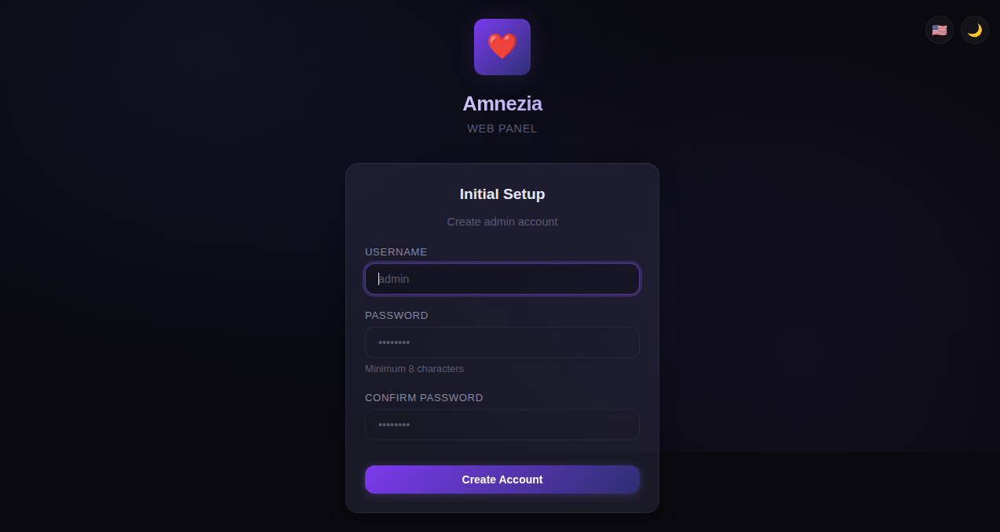
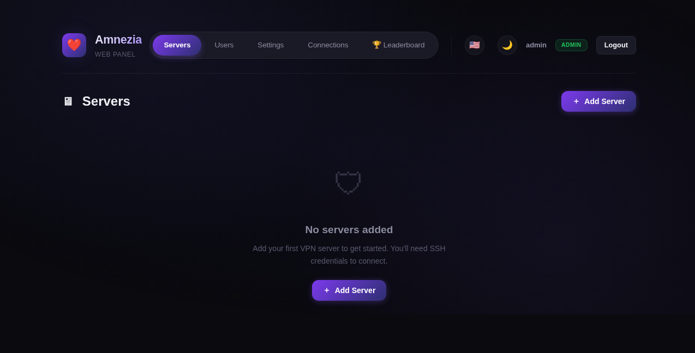

# Amnezia Web Panel

A self-hosted web administration panel for managing AmneziaWG, Xray (XTLS-Reality), Telemt, and AmneziaDNS servers. Forked from [PRVTPRO/Amnezia-Web-Panel](https://github.com/PRVTPRO/Amnezia-Web-Panel), but rebuilt from the ground up with a new data layer, expanded protocol support, and a self-service user portal.

Originally inspired by AmneziaVPN, this panel lets administrators manage users, servers, and VPN connections through a modern web interface — while end users can provision and manage their own connections without admin involvement.

---

## Features

### Multi-Protocol VPN Management

| Protocol | Description |
|----------|-------------|
| **AmneziaWG** | WireGuard-based with S3/S4 obfuscation to defeat deep packet inspection (DPI) |
| **Xray (XTLS-Reality)** | Stealthy protocol masking VPN traffic as standard HTTPS |
| **Telemt (MTProxy)** | High-performance Telegram MTProxy with TLS emulation, quotas, IP limits, and session tracking |
| **AmneziaDNS** | Internal DNS resolver preventing leaks and blocking |

### User Self-Service Portal

Regular (non-admin) users get their own **My Connections** page at `/my`:
- Create VPN connections — select server and protocol, no admin needed
- View connection details — server name, protocol, creation date
- Download configuration files, QR codes, or VPN key links
- Fully compatible with official AmneziaVPN and AmneziaWG clients

### Admin Capabilities

- Add/remove VPN servers via SSH (password or private key)
- Install and uninstall protocols per server
- User management — create, suspend, set traffic limits and expiration
- Per-user connection rate limiting and global connection quotas
- Server health monitoring and one-click reboot
- Remnawave user sync
- Traffic usage leaderboard
- Generate password-protected share links for configs

### Internationalization

Full i18n support: **English**, **Russian**, **French**, **Chinese**, **Persian** (with RTL).

### Security

- Role-based access: Admin, Support, Regular User
- Connection rate limiting (sliding window) to prevent abuse
- Per-user traffic limits with auto-disable on exhaustion
- Account expiration enforcement
- SSH keys preferred over passwords

---

## Architecture

```
app.py                  # FastAPI/Starlette application, lifespan, middleware
app/routers/            # Route handlers (auth, pages, servers, users, connections, settings, share, leaderboard)
app/utils/              # Helpers, templates, rate limiter
app/services/           # Background task orchestrator, supervisor
database.py             # SQLite (WAL mode) database wrapper — replaces data.json
schemas.py              # Pydantic request/response models
dependencies.py         # Auth dependencies (get_current_user, etc.)
config.py               # Configuration, translations, DB init
ssh_manager.py           # SSH connection manager (Paramiko)
awg_manager.py           # AmneziaWG protocol manager
xray_manager.py          # Xray (XTLS-Reality) protocol manager
telemt_manager.py        # Telemt (MTProto) protocol manager
dns_manager.py           # AmneziaDNS protocol manager
```

### Database

Originally this project stored all data in a `data.json` flat file. It has been migrated to **SQLite (WAL mode)** for ACID compliance, concurrent safety, and reliable storage. Migration is handled by `migrate_to_sqlite.py`.

### Tests

A full pytest suite covers all protocol managers and API endpoints:

```
tests/
  test_api_connections.py
  test_awg_manager.py
  test_dns_manager.py
  test_leaderboard.py
  test_telemt_manager.py
  test_traffic_rxtx.py
```

---

## Prerequisites

- **Python 3.10+**
- **SQLite3** (bundled with Python)
- Target servers: **Ubuntu 20.04/22.04/24.04** (x86_64 or ARM64)
- SSH access to target servers (password or private key)

---

## Installation

```bash
git clone https://github.com/devops-igor/amnezia-web-ui.git
cd amnezia-web-ui

python -m venv venv
source venv/bin/activate

pip install -r requirements.txt
```

If migrating from an existing `data.json` setup:

```bash
python migrate_to_sqlite.py
```

Then start the panel:

```bash
python app.py
```

The panel will be available at `http://localhost:5000`.

### First Login

On first startup with an empty database, the panel redirects all requests to the **Setup Wizard** at `/setup`. You choose your own username and password — no random credentials in logs, no forced password change.



After creating the account, you're automatically logged in and taken to the dashboard:



---

## Running with Docker

```bash
docker build -t amnezia-web-panel .
docker run -p 5000:5000 -v $(pwd)/panel.db:/app/panel.db amnezia-web-panel
```

The container uses SQLite with a volume mount so data persists across restarts.

---

## API Documentation

The panel ships with self-documenting API endpoints:

- **Swagger UI**: `http://localhost:5000/docs`
- **ReDoc**: `http://localhost:5000/redoc`

Note: API authentication is session-based (cookie). A dedicated public REST API for external integrations is not currently implemented.

---

## Configuration

### Environment Variables

| Variable | Default | Description |
|----------|---------|-------------|
| `SECRET_KEY` | `dev-secret-key` | Session signing key — **change in production** |
| `DATABASE_PATH` | `panel.db` | Path to SQLite database file |

### Rate Limiting

Connection rate limits are configurable per-user and globally via **Settings → Connection Limits**:
- Maximum connections per user
- Connection rate limit (connections per time window)

### Traffic Limits

Admins can set per-user traffic limits (bytes). When a user hits their limit, their account is automatically suspended.

---

## Technology Stack

- **Backend**: FastAPI / Starlette (Python)
- **Frontend**: Vanilla JS, Jinja2 templates, custom CSS (glassmorphism design, dark/light mode)
- **Database**: SQLite (WAL mode) — threaded, concurrent-safe
- **SSH**: Paramiko
- **Security**: bcrypt password hashing, CSRF protection, rate limiting (slowapi)
- **Testing**: pytest (765+ tests), Playwright E2E

---

## Security Recommendations

- Run behind a reverse proxy (Nginx/Caddy) with SSL termination
- Set a strong `SECRET_KEY` environment variable in production
- Prefer SSH keys over passwords for server connections
- Restrict access to the panel via firewall/network segmentation
- The first-run setup wizard ensures no credentials are exposed in container logs

---

## Contributing

Issues and pull requests are welcome. When submitting a PR, please ensure:

- All pytest tests pass (`pytest`)
- No black formatting violations (`black --check .`)
