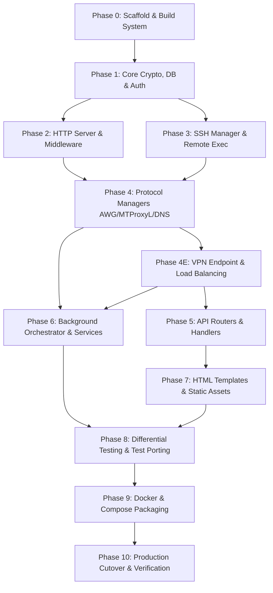

# Amnezia Web Panel — Go Rewrite & Load Balancing Implementation Plan

> **For Antigravity Orchestrator (`pm_bot`):** Implement this plan phase-by-phase using subagent delegation (`dev_bot` for Go implementation & unit tests, `qa_bot` for independent verification & security review, `git_bot` for branch and PR lifecycle).
> 
> **CRITICAL ARCHITECTURAL DIRECTIVE:** All implementations MUST strictly follow the Ground Truth Specification Documents located in `docs/specs/`. Subagents are not required to reverse-engineer Python source code; the specifications in `docs/specs/` are the authoritative source of truth:
> - [`docs/specs/01-domain-model.md`](../specs/01-domain-model.md) — Exact Go structs, validation rules, enums, normalization.
> - [`docs/specs/02-configuration.md`](../specs/02-configuration.md) — Env vars, settings table registry, SSL encryption, i18n loader.
> - [`docs/specs/03-database.md`](../specs/03-database.md) — DDL schemas, WAL pragmas, catalog of 67 DB methods, VPN tables.
> - [`docs/specs/04-external-services.md`](../specs/04-external-services.md) — SSH/SFTP, Docker specs, `awg_tc`, binary CPS packets, Noise IK probes.
> - [`docs/specs/05-api-contract.md`](../specs/05-api-contract.md) — 64 HTTP endpoints (methods, paths, payloads, status codes, auth, CSRF).
> - [`docs/specs/06-background-jobs.md`](../specs/06-background-jobs.md) — Orchestrator algorithms, traffic deltas, rollover, supervisor.

**Goal:** Rewrite the entire Amnezia Web Panel from Python/FastAPI to idiomatic, high-performance Golang, preserving 100% of existing management functionality, HTTP APIs, remote server integrations, configuration formats, database schema compatibility, and user-visible behavior — while adding a new VPN endpoint / load balancing subsystem where the portal itself becomes a single AWG entry point that forwards user traffic to backend VPN servers via in-process AmneziaWG tunnels.

**Architecture:** Single self-contained Go binary serving HTTP (`net/http` + `chi` v5 router), pure-Go SQLite (`modernc.org/sqlite` — zero CGO, cross-compile ready), embedded server-rendered HTML templates (`html/template` with `go:embed`), native userspace AmneziaWG tunnel management (`github.com/amnezia-vpn/amneziawg-go` for both backend tunnel forwarding and health probing), and structured concurrent background services (`golang.org/x/sync/errgroup` + `context.Context`). Deployed as a Docker image with TUN device access and `CAP_NET_ADMIN` for in-process AWG tunnels. Same `docker-compose.yml` structure (updated for new capabilities), same environment variables (with additions), same BunkerWeb WAF integration.

**Tech Stack:** Go 1.22+, `modernc.org/sqlite` (pure-Go SQLite), `github.com/go-chi/chi/v5` (HTTP router), `github.com/amnezia-vpn/amneziawg-go` (pure-Go userspace AmneziaWG engine — VPN endpoint listener, backend tunnel pool, health probing), `golang.org/x/crypto/bcrypt`, standard library Fernet-compatible encryption (`crypto/aes` + `crypto/cipher` + `crypto/hkdf` + `crypto/hmac`), `golang.org/x/crypto/ssh` + `github.com/pkg/sftp` (remote VPN management via SFTP), `golang.org/x/sync/errgroup` (concurrent task orchestration), `log/slog` (structured logging), `html/template` (context-aware autoescaping templates), `github.com/mojocnv/base64Captcha` (pure-Go CAPTCHA).

---

## 1. Current System Inventory

### 1.1 Codebase Metrics

| Component | Files | LOC | Notes |
|-----------|-------|-----|-------|
| App source (`app/`) | 29 .py | 12,724 | Core application including AWG health/Noise crypto |
| Top-level scripts | 5 .py | 497 | `app.py`, `migrate_to_sqlite.py`, `dns_manager.py`, `docker_utils.py`, `integrity.py` |
| Unit tests | 57 test files | 20,800+ | ~1,156 test cases |
| E2E tests | 7 test files | 1,858 | Playwright, 36 test cases |
| HTML templates | 11 .html | 5,932 | Jinja2 → Go `html/template` |
| CSS | 1 file | 1,737 | Static, zero change needed |
| Translations | 5 .json | 103 KB | `en`, `fa`, `fr`, `ru`, `zh` |
| **Total Python** | | **~34,021** | |
| **Total (incl. tests/templates)** | | **~62,548** | |

### 1.2 Module Map (Python → Go)

| Python Module | LOC | Go Package | Responsibility |
|---------------|-----|------------|----------------|
| `app/main.py` | 283 | `cmd/panel/main.go` | App entrypoint, middleware setup, router registration, graceful shutdown |
| `app/core/config.py` | 173 | `internal/config` | Env parsing, secret key resolution, paths, translation loader |
| `app/core/database.py` | 1,377 | `internal/database` | SQLite operations (all 67 methods), migrations, index creation |
| `app/core/security.py` | 181 | `internal/security` | Fernet-equivalent credential crypto (HKDF-SHA256 + AES-CBC-HMAC), sensitive field stripping |
| `app/core/dependencies.py` | 61 | `internal/auth` | Session-based auth, `require_admin`, `get_current_user` |
| `app/core/schema.sql` | 111 | `internal/database/schema.sql` | Embedded SQL schema (`go:embed`) |
| `app/models/schemas.py` | 766 | `internal/models` | Pydantic models → Go structs with validation tags |
| `app/routers/auth.py` | 186 | `internal/router/auth` | 7 endpoints: login, logout, setup, captcha, change-password, set_lang |
| `app/routers/servers.py` | 1,398 | `internal/router/servers` | 27 endpoints: CRUD, install/uninstall protocols, connections, speed limits, reachability, auto-trial |
| `app/routers/connections.py` | 402 | `internal/router/connections` | 5 endpoints: user-facing connection add/config/kit/rename/delete |
| `app/routers/users.py` | 366 | `internal/router/users` | 5 endpoints: user CRUD, toggle, connections |
| `app/routers/settings.py` | 152 | `internal/router/settings` | 6 endpoints: get/save settings, sync, backup/restore |
| `app/routers/share.py` | 156 | `internal/router/share` | 4 endpoints: share setup, auth, connections, config |
| `app/routers/pages.py` | 161 | `internal/router/pages` | 7 page routes: setup, index, server, users, my, leaderboard, change-password |
| `app/routers/leaderboard.py` | 41 | `internal/router/leaderboard` | 1 endpoint: `GET /api/leaderboard` |
| `app/managers/ssh_manager.py` | 295 | `internal/manager/ssh` | SSH connect, host key verification (`known_hosts`), exec, upload/download via SFTP |
| `app/managers/awg_manager.py` | 2,028 | `internal/manager/awg` | AmneziaWG: keypair/PSK gen, param gen, remote Docker container management, client CRUD, config, traffic, mimicry |
| `app/managers/awg_cps.py` | 564 | `internal/manager/awg/cps` | CPS packet generation: QUIC Initial/Short, DNS, SIP, TLS mimicry |
| `app/managers/awg_tc.py` | 901 | `internal/manager/awg/tc` | Traffic shaping: qdisc/IFB setup, speed limits, class IDs via SSH |
| `app/managers/awg_health.py` | 611 | `internal/manager/awg/health` | Pure-Go Noise IK handshake over raw UDP — reachability testing and auto-trial probes (uses `amneziawg-go` internals for handshake construction) |
| `app/managers/mtproxyl_manager.py` | 538 | `internal/manager/mtproxyl` | MTProxyL: install, client CRUD, quota, overquota enforcement |
| `app/services/background_orchestrator.py` | 588 | `internal/service/orchestrator` | Periodic tasks: traffic sync, expiry, reachability, auto-trial, remnawave sync (`errgroup`) |
| `app/services/background_supervisor.py` | 151 | `internal/service/supervisor` | Crash recovery, restart limiting (3 per 300s), health visibility |
| `app/services/background.py` | 21 | `internal/service/background` | Helper bridges for background worker execution |
| `app/services/remnawave_sync.py` | 147 | `internal/service/remnawave` | RemnaWave API sync: fetch users, create/update/delete/toggle |
| `app/services/startup_reconciliation.py` | 99 | `internal/service/reconciliation` | Stale protocol cleanup on startup |
| `app/services/user_operations.py` | 160 | `internal/service/userops` | SSH-based user delete, toggle, mass operations (`errgroup`) |
| `app/utils/helpers.py` | 344 | `internal/util` | Trusted proxies, client IP, i18n, VPN link gen, password hash, manager factory |
| `app/utils/rate_limiter.py` | 20 | `internal/middleware/ratelimit` | Token bucket / sliding window rate limiting middleware |
| `app/utils/templates.py` | 37 | `internal/template` | Template rendering helper with Jinja2-compatible `FuncMap` |
| `migrate_to_sqlite.py` | 162 | `internal/database/migrate` | One-time `data.json` → SQLite migration |
| `dns_manager.py` | 99 | `internal/manager/dns` | AmneziaDNS (Unbound) install/status/remove |
| `docker_utils.py` | 79 | `internal/util/docker` | Docker check, package manager detection, AppArmor utils |
| `integrity.py` | 110 | `internal/util/integrity` | SHA256 file/content integrity verification |
| _(new — no Python equivalent)_ | — | `internal/vpn` | VPN endpoint listener: accept user AWG connections, authenticate peers, assign to backend tunnels |
| _(new — no Python equivalent)_ | — | `internal/vpn/tunnel` | Backend tunnel pool: establish/maintain/teardown in-process AWG tunnels to backend servers via `amneziawg-go` |
| _(new — no Python equivalent)_ | — | `internal/vpn/loadbalancer` | Load balancing: server selection algorithm (least-connections/weighted/round-robin), health-based routing, tunnel assignment |
| _(new — no Python equivalent)_ | — | `internal/vpn/forwarder` | Traffic forwarding: bidirectional packet relay between user tunnels and backend tunnels, traffic accounting |
| _(new — no Python equivalent)_ | — | `internal/router/vpn` | New API endpoints: tunnel status, backend health, load balancing config, active connections view |

### 1.3 API Surface

#### Existing Endpoints (54 — must preserve 1:1)

**Auth (7):**
- `GET  /login`
- `GET  /set_lang/{lang}`
- `GET  /logout`
- `GET  /api/auth/captcha`
- `POST /api/auth/login`
- `POST /api/auth/change-password`
- `POST /api/auth/setup`

**Servers (27):**
- `GET  /`
- `POST /add`
- `POST /confirm-fingerprint`
- `POST /{server_id}/delete`
- `POST /{server_id}/reboot`
- `POST /{server_id}/clear`
- `POST /{server_id}/stats`
- `POST /{server_id}/check`
- `POST /{server_id}/install`
- `POST /{server_id}/uninstall`
- `POST /{server_id}/container/toggle`
- `POST /{server_id}/server_config`
- `POST /{server_id}/server_config/save`
- `GET  /{server_id}/connections`
- `POST /{server_id}/connections/add`
- `POST /{server_id}/connections/{client_id}/rotate-mimicry`
- `GET  /server_id}/reachability`
- `POST /{server_id}/connections/auto-trial`
- `POST /{server_id}/connections/kit`
- `POST /{server_id}/connections/remove`
- `POST /{server_id}/connections/edit`
- `POST /{server_id}/connections/config`
- `POST /{server_id}/connections/toggle`
- `GET  /{server_id}/{protocol}/clients`
- `PATCH /{server_id}/connections/speed-limit`
- `GET  /{server_id}/awg/speed-limit-config`
- `PATCH /{server_id}/awg/speed-limit-config`
- `POST /{server_id}/awg/apply-default-speed-limits`

**Connections (5):**
- `POST /add`
- `POST /{connection_id}/config`
- `POST /{connection_id}/kit`
- `POST /{connection_id}/rename`
- `POST /{connection_id}/delete`

**Users (5):**
- `POST /add`
- `POST /{user_id}/update`
- `POST /{user_id}/delete`
- `POST /{user_id}/toggle`
- `POST /{user_id}/connections/add`
- `GET  /{user_id}/connections`

**Settings (6):**
- `GET  /settings`
- `GET  /api/settings`
- `POST /api/settings/save`
- `POST /api/settings/sync_now`
- `POST /api/settings/sync_delete`
- `GET  /api/settings/backup/download`
- `POST /api/settings/backup/restore`

**Share (4):**
- `POST /api/users/{user_id}/share/setup`
- `GET  /share/{token}`
- `POST /api/share/{token}/auth`
- `GET  /api/share/{token}/connections`
- `POST /api/share/{token}/config/{connection_id}`

**Pages (7):**
- `GET /setup`
- `GET /`
- `GET /change-password`
- `GET /server/{server_id}`
- `GET /users`
- `GET /my`
- `GET /leaderboard`

**Leaderboard (1):**
- `GET /api/leaderboard`

#### New Endpoints (VPN Endpoint & Load Balancing)

**VPN Status & Admin (7):**
- `GET  /api/vpn/status` — Overall VPN endpoint status: listener state, active tunnels, connected users
- `GET  /api/vpn/backends` — List backend servers with tunnel health, load, capacity
- `POST /api/vpn/backends/{server_id}/enable` — Enable a backend server for load balancing
- `POST /api/vpn/backends/{server_id}/disable` — Disable a backend server (drain connections)
- `GET  /api/vpn/tunnels` — List active user-to-backend tunnel mappings
- `GET  /api/vpn/config` — Get load balancing configuration (algorithm, weights, health thresholds)
- `POST /api/vpn/config` — Save load balancing configuration

**User VPN Connection (3):**
- `GET  /api/vpn/my-connection` — User's current VPN connection state (connected, backend, latency)
- `GET  /api/vpn/my-config` — Generate AWG client config for connecting to the portal VPN endpoint
- `POST /api/vpn/disconnect` — Admin-forced disconnect of a user's VPN session

### 1.4 Database Schema

#### Existing Tables (7 — must be binary-compatible)

| Table | Purpose | Key Fields |
|-------|---------|------------|
| `servers` | VPN server records | `id`, `name`, `host`, `ssh_user`, `ssh_port`, `ssh_pass`, `ssh_key`, `protocols` (JSON), `created_at` |
| `users` | User accounts | `id` (UUID), `username`, `password_hash`, `role`, `enabled`, traffic totals/deltas, monthly counters, `expires_at`, `expiration_date`, `awg_mimicry`, `password_change_required`, `limits` (JSON) |
| `user_connections` | User-to-protocol bindings | `id` (UUID), `user_id`, `server_id`, `protocol`, `client_id`, `name`, `awg_mimicry`, traffic counters |
| `connection_creation_log` | Rate limiting audit | `id`, `user_id`, `created_at` |
| `settings` | Key-value application settings | `key`, `value` (JSON) |
| `migration_flags` | Migration execution tracking | `key`, `value` |
| `known_hosts` | SSH host key fingerprints | `server_id`, `fingerprint`, `first_seen` |
| `leaderboard_snapshots` | Monthly traffic leaderboard | `id`, `year`, `month`, `username`, `rank`, `download`, `upload`, `total`, `snapshot_at` |

*Schema version is tracked in `settings` table (`key='schema_version'`). Managed by `internal/database` versioning.*

#### New Tables (VPN Endpoint & Load Balancing)

| Table | Purpose | Key Fields |
|-------|---------|------------|
| `backend_tunnels` | In-process AWG tunnels to backend servers | `id`, `server_id` (FK), `interface_name`, `public_key`, `private_key` (encrypted), `endpoint`, `status` (connecting/active/degraded/disabled), `last_health_check`, `latency_ms`, `active_connections`, `created_at` |
| `vpn_sessions` | Active user VPN sessions through the portal | `id`, `user_id` (FK), `backend_tunnel_id` (FK), `peer_public_key`, `assigned_ip`, `connected_at`, `last_seen`, `rx_bytes`, `tx_bytes`, `status` (connected/disconnected/draining) |
| `vpn_config` | Load balancing and VPN endpoint configuration (key-value) | `key`, `value` (JSON) — algorithm, weights, health thresholds, listen port, endpoint keys |

*New tables are additive — existing `panel.db` works without them. Schema migration adds them on first boot when schema version is incremented.*

### 1.5 External Integrations

1. **SSH** (`golang.org/x/crypto/ssh` + `github.com/pkg/sftp`): Connect to remote VPN servers, command execution, sudo execution, file upload/download via SFTP (matching paramiko behavior), host key verification against `known_hosts` table with SHA256 fingerprints.
2. **Docker CLI** (on remote servers via SSH): Install, run, inspect, and destroy VPN protocol containers (`amnezia-awg`, `amnezia-telemt`, `amnezia-dns`).
3. **AmneziaWG (AWG)** — two distinct usages:
   - **Remote Docker container** (`amneziavpn/amneziawg-go:latest`): Deployed on remote VPN servers as the actual VPN server. Managed via SSH + Docker commands. This is the existing behavior — unchanged.
   - **In-process library** (`github.com/amnezia-vpn/amneziawg-go` as Go import): Used in the portal itself for (a) accepting user AWG connections as a VPN endpoint, (b) establishing backend tunnels to remote VPN servers, (c) health probing via Noise IK handshake. Replaces the pure-Python `awg_health.py` implementation with the real AWG protocol stack.
4. **MTProxyL**: Telegram MTProto proxy. Python CLI wrapper replacement with direct remote execution and quota management.
5. **DNS (Unbound)**: AmneziaDNS caching/forwarding service via Docker on remote servers.
6. **RemnaWave**: External API sync (`net/http` client with Bearer auth), user reconciliation and connection binding.
7. **BunkerWeb WAF**: Docker labels and environment variables. Compose integration preserved with additions for new VPN port mappings.
8. **Fernet Encryption**: Standard library Go implementation of Fernet (HKDF-SHA256 key derivation from `SECRET_KEY`, AES-128-CBC + HMAC-SHA256, `gAAAAA...` token format). Must decrypt existing Python-encrypted credentials.
9. **bcrypt**: Password hashing using `golang.org/x/crypto/bcrypt` (cost 12, safe handling of 72-byte limit). Must verify existing Python-generated bcrypt hashes.
10. **i18n**: 5 languages (`en`, `fa`, `fr`, `ru`, `zh`), embedded JSON files, cookie-based language selection.
11. **CAPTCHA**: Pure-Go CAPTCHA generator (`github.com/mojocnv/base64Captcha`), math/character challenges with visual noise. Must produce visually similar output to Python `multicolorcaptcha` — verify E2E auth tests can be adapted.

### 1.6 Background Tasks (Orchestrator: 60s initial delay, 600s interval)

| Task | Concurrency Strategy | Description |
|------|----------------------|-------------|
| `sync_traffic` | Parallel across servers with `errgroup` (max concurrency 10) | SSH to all servers, query protocol managers for client bytes, compute deltas, update user traffic, monthly rollover, leaderboard snapshot, enforce limits, disable expired/over-limit users |
| `check_expiry` | In-memory sequential | Disable users past `expires_at` or `expiration_date` |
| `check_server_reachability` | Parallel TCP & AWG Noise probes with `errgroup` | Probe server IPs & ports with timeout, update cache |
| `check_auto_trial_handshakes` | Parallel across servers with `errgroup` | Query `wg show` on AWG servers to confirm handshake for auto-mode mimicry |
| `sync_remnawave` | Single worker routine with context timeout | Pull users from RemnaWave API and sync to local DB |
| `check_backend_tunnel_health` _(new)_ | Parallel across active backend tunnels with `errgroup` | Probe each backend AWG tunnel via `amneziawg-go` handshake, measure latency, update `backend_tunnels` status, trigger failover if degraded |
| `rebalance_vpn_sessions` _(new)_ | Sequential — holds mutex during rebalancing | Evaluate load distribution across backends, migrate sessions if imbalance exceeds threshold, update `vpn_sessions` assignments |

*Supervisor: crash recovery with exponential backoff, restart limit of 3 restarts per 300s window, health visibility.*

---

## 2. Go Architecture & Technical Decisions

### 2.1 Standard Project Layout

```
.
├── cmd/
│   └── panel/
│       └── main.go                 # Entrypoint, flags, signal trapping, server lifecycle
├── internal/
│   ├── auth/                       # Session store, require_admin, user context helpers
│   ├── config/                     # Env parsing, SECRET_KEY, DATA_DIR, path resolution
│   ├── database/                   # SQLite (modernc.org/sqlite), schema.sql, 67 DB methods, migrations
│   ├── manager/
│   │   ├── awg/                    # AmneziaWG remote container manager, keygen, config generation
│   │   │   ├── cps/                # Binary CPS packet generation (QUIC, DNS, SIP, TLS)
│   │   │   ├── health/             # AWG Noise protocol reachability probes (via amneziawg-go)
│   │   │   └── tc/                 # Traffic control (tc, qdisc, ifb speed limits)
│   │   ├── dns/                    # Unbound DNS manager
│   │   ├── mtproxyl/               # MTProxyL manager & quota enforcement
│   │   └── ssh/                    # SSHClient interface, connection pooling, host key verification, SFTP
│   ├── middleware/                 # CSRF, Session, RateLimit, SetupRedirect, PasswordChange, Logging
│   ├── models/                     # Data models, request/response DTOs, validation logic
│   ├── router/                     # HTTP route handlers (auth, servers, connections, users, settings, share, pages, vpn)
│   ├── security/                   # Pure Go Fernet encryption, sensitive field stripping
│   ├── service/
│   │   ├── background/             # Common background helpers
│   │   ├── orchestrator/           # Periodic background task runner (errgroup)
│   │   ├── reconciliation/         # Startup stale protocol cleaner
│   │   ├── remnawave/              # RemnaWave external API sync client
│   │   ├── supervisor/             # Task supervisor with crash recovery & circuit breaker
│   │   └── userops/                # Parallel user delete, toggle, mass SSH operations
│   ├── template/                   # html/template engine, FuncMap, layout composition
│   ├── util/                       # Docker utils, integrity verification, IP/proxy helpers
│   └── vpn/                        # VPN endpoint & load balancing subsystem (NEW)
│       ├── endpoint/               # AWG listener: accept user connections, peer authentication, IP allocation
│       ├── tunnel/                 # Backend tunnel pool: in-process AWG tunnels to backend servers (amneziawg-go)
│       ├── loadbalancer/           # Server selection: algorithm, health-based routing, weighted distribution
│       └── forwarder/              # Traffic forwarding: bidirectional packet relay, traffic accounting
├── web/
│   ├── static/                     # CSS, JS, favicons, vendor assets (go:embed)
│   ├── templates/                  # HTML templates (go:embed)
│   └── translations/               # en.json, fa.json, fr.json, ru.json, zh.json (go:embed)
├── Dockerfile                      # Multi-stage build (golang:alpine -> alpine with TUN access)
├── Makefile                        # Build, test, lint, security scan targets
└── go.mod
```

### 2.2 HTTP Routing: `chi` v5 & Go 1.22+ `net/http`

- **Decision:** Use `github.com/go-chi/chi/v5` built on top of standard `net/http`.
- **Rationale:**
  1. 100% compatible with standard library `http.Handler` and `http.HandlerFunc`.
  2. Zero external dependencies beyond standard library.
  3. Clean route grouping and sub-routing (`r.Route("/api/servers", ...)`).
  4. Robust middleware stack composition with context passing.
  5. URL parameter extraction via `chi.URLParam(r, "server_id")`.
  6. High performance, zero allocations during routing.
- **Legacy Note:** `gorilla/mux` is explicitly excluded due to historical maintenance lapses and heavier footprint.

### 2.3 Pure-Go SQLite: `modernc.org/sqlite`

- **Decision:** Use `modernc.org/sqlite` instead of `mattn/go-sqlite3`.
- **Rationale:**
  1. **Zero CGO:** Compiles with `CGO_ENABLED=0`, enabling true static binary generation for `scratch` or `distroless` images.
  2. **Cross-Compilation:** Easily build for `linux/amd64`, `linux/arm64`, `darwin`, and `windows` without gcc toolchains.
  3. **Database Concurrency Model:**
     - Enable WAL mode on initialization (`PRAGMA journal_mode=WAL;`).
     - Set busy timeout (`PRAGMA busy_timeout=5000;`).
     - Enable foreign keys (`PRAGMA foreign_keys=ON;`).
     - Configure connection pool: MaxOpenConns calibrated to serialize writes (`db.SetMaxOpenConns(1)` or single-writer mutex) while allowing concurrent reads, preventing `database is locked` errors.

### 2.4 Cryptography & Fernet Compatibility Specification

To ensure existing encrypted SSH credentials and SSL certificates decrypt seamlessly:
1. **Key Derivation (HKDF-SHA256):**
   ```go
   hkdfReader := hkdf.New(sha256.New, []byte(secretKey), []byte("amnezia-panel-credential-encryption"), []byte("fernet-credential-key"))
   rawKey := make([]byte, 32)
   _, _ = io.ReadFull(hkdfReader, rawKey)
   // First 16 bytes: HMAC-SHA256 signing key
   // Second 16 bytes: AES-128-CBC encryption key
   signingKey := rawKey[:16]
   encryptionKey := rawKey[16:]
   ```
2. **Token Format:**
   `Base64URL( 0x80 (1 byte) || Timestamp (8 bytes, Big-Endian) || IV (16 bytes) || Ciphertext (AES-CBC PKCS#7) || HMAC-SHA256 (32 bytes) )`
3. **Verification:**
   - Compute HMAC-SHA256 over `Version || Timestamp || IV || Ciphertext`.
   - Verify HMAC using constant-time comparison (`crypto/subtle.ConstantTimeCompare`).
   - Decrypt with AES-128-CBC and unpad PKCS#7.
4. **Interoperability Testing:** Include Python-generated test vectors in unit test suites to guarantee 100% round-trip compatibility.

### 2.5 Structured Concurrency: `errgroup` & `context`

- Replace `asyncio.to_thread` and sequential loops with `golang.org/x/sync/errgroup`:
  ```go
  g, ctx := errgroup.WithContext(parentCtx)
  g.SetLimit(10) // Bounded concurrency across servers

  for _, s := range servers {
      server := s
      g.Go(func() error {
          select {
          case <-ctx.Done():
              return ctx.Err()
          default:
              return syncServerTraffic(ctx, server)
          }
      })
  }
  if err := g.Wait(); err != nil {
      slog.Error("traffic sync encountered errors", "err", err)
  }
  ```
- Graceful shutdown: Main traps `SIGINT` / `SIGTERM`, cancels root `context.Context`, stops background supervisor, drains VPN tunnels, and calls `httpServer.Shutdown(ctx)` with a 15-second grace period.

### 2.6 HTML Template Engine (`html/template`)

- **Composition Pattern:** Layouts defined with `{{ define "content" }}...{{ end }}` and base master templates.
- **Custom `FuncMap`:**
  - `t`: Translate key with active language from request context.
  - `tojson`: Marshal struct/map to safe JSON.
  - `default`: Fallback value if empty.
  - `url_for`: Generate static URL with cache-busting SHA256 query param.
  - `format_bytes`: Convert raw bytes to human-readable B / KB / MB / GB.
  - `format_date`: Format ISO timestamps to localized strings.
  - `time_ago`: Relative time string.
  - `csrf_token`: Extract and inject active CSRF token into hidden inputs.

### 2.7 Session Cookie Compatibility

**Decision:** Re-login is acceptable. The Go server implements its own signed-cookie session store (HMAC-SHA256 + base64 JSON, same semantics as Starlette — 7-day TTL, `SameSite=Lax`, cookie name `session`). Existing Python-issued session cookies will NOT be valid on the Go server. Users will need to re-login once after cutover. This is documented in the migration guide and is an acceptable tradeoff for avoiding the complexity of implementing a Starlette/itsdangerous-compatible cookie parser.

### 2.8 VPN Endpoint & Load Balancing Architecture (NEW)

This subsystem does not exist in the Python codebase. It is new functionality enabled by the Go rewrite.

**Overview:** The portal becomes an AWG VPN endpoint. Users connect to the portal via AWG (the portal listens on a UDP port). The portal authenticates the user's peer public key, assigns an internal IP, and establishes (or reuses) an in-process AWG tunnel to a healthy backend VPN server. Traffic is forwarded bidirectionally: user → portal → backend → internet.

**Components:**

1. **VPN Endpoint Listener** (`internal/vpn/endpoint`):
   - In-process AWG listener via `amneziawg-go` (creates TUN device, binds UDP port).
   - Peer authentication: validates connecting user's public key against `user_connections` table (AWG clients registered in the panel).
   - IP allocation: assigns each connected user a unique internal IP from a configurable subnet.
   - Session lifecycle: tracks connected users in `vpn_sessions` table, handles connect/disconnect/timeout.

2. **Backend Tunnel Pool** (`internal/vpn/tunnel`):
   - Maintains a pool of in-process AWG tunnels to backend VPN servers (one tunnel per backend, interface `awg-be-<server_id>`).
   - Each tunnel uses `amneziawg-go` to create a TUN device and establish a WireGuard/AWG tunnel to the backend server's AWG endpoint.
   - Tunnel lifecycle: connect on demand or pre-connect at startup, health-check periodically, teardown on failure or disable.
   - Tunnel state persisted in `backend_tunnels` table.

3. **Load Balancer** (`internal/vpn/loadbalancer`):
   - Server selection algorithm: configurable (least-connections, weighted-round-robin, round-robin).
   - Health-based routing: only selects backends with `active` tunnel status and acceptable latency.
   - Sticky sessions: once a user is assigned to a backend, keep them there unless the backend degrades or the user disconnects.
   - Failover: if a backend tunnel goes down, affected user sessions are migrated to another healthy backend.
   - Capacity limits: per-backend max connections, global max connections.

4. **Traffic Forwarder** (`internal/vpn/forwarder`):
   - Bidirectional packet relay between user TUN interface and backend TUN interface.
   - Per-session goroutine pair (read user → write backend, read backend → write user).
   - Traffic accounting: bytes in/out per session, feeds into existing traffic tracking system (`user_connections` traffic counters).
   - Rate limiting: enforces per-user speed limits via the existing `awg_tc` mechanism (applied on backend servers) or locally via `tc` on the portal's TUN interfaces.

**Docker Security Model Changes:**

The current Python container is: read-only rootfs, non-root (100:101), `no-new-privileges`, no TUN access. The Go rewrite with VPN endpoint requires:

| Capability | Current (Python) | New (Go with VPN) | Rationale |
|-----------|-------------------|-------------------|-----------|
| TUN device | None | `/dev/net/tun` mounted | AWG userspace tunnel needs TUN |
| Capabilities | None | `CAP_NET_ADMIN` | Create interfaces, set routes, iptables |
| Root filesystem | Read-only | Read-write (or tmpfs for runtime state) | `amneziawg-go` creates sockets in `/var/run/amneziawg/` |
| User | Non-root (100:101) | Root or `CAP_NET_ADMIN` + TUN group | TUN device access requires privileges |
| Ports | 5000 (HTTP) | 5000 (HTTP) + AWG UDP port (configurable, default 51820) | VPN endpoint listener |

**Mitigation:** The security tradeoff is accepted. BunkerWeb WAF still protects the HTTP port. The AWG UDP port is authenticated at the protocol level (WireGuard/AWG handshake). The container runs with minimal privileges beyond what AWG requires — no `CAP_SYS_ADMIN`, no host PID/network namespace, no privileged mode.

---

## 3. Implementation Phases



### Phase 0: Project Scaffold & Build System (1-2 days)
**Lead:** `dev_bot` | **Auditor:** `qa_bot`  
**Primary Specifications:** [`docs/specs/01-domain-model.md`](../specs/01-domain-model.md), `.agents/workflow.md`
- 0.1 Read `.agents/workflow.md`, `.agents/py_bot.md`, `.agents/dev_bot.md`, `.agents/qa_bot.md`, `.agents/git_bot.md` and register subagents per the workflow.
- 0.2 Initialize Go module (`go mod init github.com/devops-igor/amnezia-web-ui-go`).
- 0.3 Set up standard directory structure (`cmd/panel`, `internal/...`, `web/...`).
- 0.4 Create `Makefile` with targets: `build`, `test`, `test-race`, `lint`, `security`, `docker-build`.
- 0.5 Configure `golangci-lint` (.golangci.yml) with strict linters (`govet`, `staticcheck`, `errcheck`, `gosec`, `gocyclo`, `revive`).
- 0.6 Set up CI workflow for automated compilation gates.

### Phase 1: Core Infrastructure & Cryptography (3-4 days)
**Lead:** `dev_bot` | **Auditor:** `qa_bot`  
**Primary Specifications:** [`docs/specs/01-domain-model.md`](../specs/01-domain-model.md), [`docs/specs/02-configuration.md`](../specs/02-configuration.md), [`docs/specs/03-database.md`](../specs/03-database.md)
- 1.1 Config package: Environment parsing, `SECRET_KEY` resolution (env → `.secret_key` file → random generation), `DATA_DIR` management per `docs/specs/02-configuration.md`.
- 1.2 Translation loader: Embedded JSON translations (`web/translations/*.json`), memory caching, `_t(lang, key)` lookup per `docs/specs/02-configuration.md`.
- 1.3 Database package: Pure-Go SQLite (`modernc.org/sqlite`), WAL mode, busy timeout, embedded `schema.sql`, schema versioning per `docs/specs/03-database.md`.
- 1.4 Database migrations: Runtime index creation, default settings seeding, schema migration runner per `docs/specs/03-database.md`.
- 1.5 Data.json → SQLite migration: One-time migration on first boot if `panel.db` doesn't exist but `data.json` does (port of `migrate_to_sqlite.py`). Validates data structure, inserts records, renames `data.json` → `data.json.bak` per `docs/specs/03-database.md`.
- 1.6 Database methods: Implement and test all 67 DB methods across `servers`, `users`, `user_connections`, `settings`, `known_hosts`, `leaderboard_snapshots` per `docs/specs/03-database.md`.
- 1.7 Fernet cryptography: Standard library HKDF-SHA256 + AES-128-CBC + HMAC-SHA256. Unit test against Python-generated test vectors per `docs/specs/02-configuration.md`.
- 1.8 Plaintext migration: In-place encryption of legacy unencrypted SSH credentials in existing databases.
- 1.9 Password hashing: `golang.org/x/crypto/bcrypt` (cost 12, max 72-byte safe handling). Verify against existing Python-generated bcrypt hashes.
- 1.10 Session store: Signed cookie session encoder/decoder (HMAC-SHA256 + base64 JSON). Not compatible with existing Python session cookies — re-login required after cutover (see Section 2.7).
- 1.11 Integrity & hashing: SHA256 file/payload integrity checking with constant-time comparison.

*Verification Gate 1:* 100% test pass on DB CRUD, exact Fernet decryption of Python ciphertext vectors, bcrypt cross-verification against existing hashes, data.json migration round-trip against `docs/specs/03-database.md`.

### Phase 2: HTTP Server & Middleware Stack (2-3 days)
**Lead:** `dev_bot` | **Auditor:** `qa_bot`  
**Primary Specifications:** [`docs/specs/02-configuration.md`](../specs/02-configuration.md), [`docs/specs/05-api-contract.md`](../specs/05-api-contract.md)
- 2.1 HTTP server setup (`chi` v5, static file handler, template engine integration).
- 2.2 Session Middleware: Signed cookie session handling (7-day TTL, `SameSite=Lax`, name="session").
- 2.3 CSRF Middleware: Double-submit cookie pattern (`csrftoken` cookie, `x-csrf-token` header, constant-time validation per `docs/specs/05-api-contract.md`).
- 2.4 Rate Limiting Middleware: In-memory token bucket rate limiter for `/api/auth/login` and generic API paths.
- 2.5 Setup Redirect Middleware: Intercept requests and redirect to `/setup` if user count is 0.
- 2.6 Password Change Middleware: Restrict access to `/api/auth/change-password` and `/logout` if `password_change_required` is set.
- 2.7 Trusted Proxy & Client IP: CIDR-aware `X-Forwarded-For` parsing respecting `TRUSTED_PROXIES` per `docs/specs/02-configuration.md`.
- 2.8 Error Sanitization Middleware: Sanitize client-facing error messages per `docs/specs/05-api-contract.md` (strip local file paths, internal IPs, server secrets).
- 2.9 TLS/SSL Support: Dynamic certificate/key loading from database settings per `docs/specs/02-configuration.md`.
- 2.10 Graceful Shutdown: Clean listener drain and background context cancellation.

*Verification Gate 2:* Middleware test suite passes with 100% route coverage on auth checks, CSRF rejections, and rate limits defined in `docs/specs/05-api-contract.md`.

### Phase 3: SSH Manager & Remote Execution (2 days)
**Lead:** `dev_bot` | **Auditor:** `qa_bot`  
**Primary Specifications:** [`docs/specs/04-external-services.md`](../specs/04-external-services.md)
- 3.1 SSH client manager (`golang.org/x/crypto/ssh`): Password, RSA, Ed25519, ECDSA private key auth per `docs/specs/04-external-services.md`.
- 3.2 Host key verification: Strict verification against `known_hosts` DB table with SHA256 fingerprints; support interactive fingerprint confirmation per `docs/specs/04-external-services.md`.
- 3.3 Remote command execution: `RunCommand`, `RunSudoCommand`, `RunScript`, `RunSudoScript`.
- 3.4 File operations via SFTP (`github.com/pkg/sftp`): Atomic file upload, sudo file upload, download, existence checks. SFTP chosen over SCP to match paramiko behavior and support partial transfers.
- 3.5 Connection pooling & KeepAlive: Reuse open SSH connections during traffic sync sweeps with timeout reclamation.
- 3.6 Docker utilities: Remote Docker detection, package manager detection (apt, yum, dnf, pacman), AppArmor profile helpers.

*Verification Gate 3:* Hermetic tests against mock SSH server (`gliderlabs/ssh`) and live integration tests on remote test VPS per `docs/specs/04-external-services.md`.

### Phase 4: Protocol Managers (6-8 days)
**Lead:** `dev_bot` (Parallelizable sub-tasks) | **Auditor:** `qa_bot`  
**Primary Specifications:** [`docs/specs/01-domain-model.md`](../specs/01-domain-model.md), [`docs/specs/04-external-services.md`](../specs/04-external-services.md)

> **Parallelization note:** Max 3 concurrent `dev_bot` instances. Recommended sequence: 4A (AWG, 4-5 days) + 4B (MTProxyL, 2 days) start together. 4C (DNS, 1 day) starts after MTProxyL completes. This stays within the 3-instance limit.

- **4A. AmneziaWG (AWG) Manager (4-5 days):**
  - Remote container lifecycle: Docker build/run of `amneziavpn/amneziawg-go:latest` on remote servers, `wg0.conf` rendering, `clients.json` synchronization per `docs/specs/04-external-services.md`.
  - Keypair & parameter generation (Curve25519, PSK, Jc/Jmin/Jmax, S1-S4, H1-H4 obfuscation headers).
  - Binary CPS packet crafting (`gen_quic_initial`, `gen_quic_short`, `gen_dns`, `gen_sip`, `gen_tls`, `to_cps`) per `docs/specs/04-external-services.md`.
  - Remote traffic control (`awg_tc`): `tc`/`qdisc`/`ifb` setup, peer-to-class-id mapping, bandwidth limits per `docs/specs/04-external-services.md`.
  - Client CRUD: `AddClient`, `RemoveClient`, `EditClient`, `ToggleClient`, `RotateMimicry`, `GetClientConfig`.
  - Noise protocol health probes (`awg_health`): Port the pure-Python Noise IK handshake to Go using `amneziawg-go` protocol internals per `docs/specs/04-external-services.md`. Craft AWG handshake initiation packets, verify response packets, measure round-trip latency. Must produce byte-for-byte identical handshake packets to the Python implementation.
  - Speed limit configuration: Global and per-connection speed limits, bulk apply.

- **4B. MTProxyL Manager (2 days):**
  - Remote container lifecycle & CLI integration per `docs/specs/04-external-services.md`.
  - Client secret generation (dd-secrets), add/edit/remove/toggle clients.
  - Quota enforcement & overquota disabling.

- **4C. DNS Manager (1 day):**
  - Unbound DNS Docker container installation, `forward-records.conf` generation, health check per `docs/specs/04-external-services.md`.

*Verification Gate 4:*
- Golden file diff testing for all generated protocol configs (AWG, MTProxyL, DNS) against Python baselines.
- **Noise protocol byte-for-byte verification:** Go-crafted AWG handshake initiation packets must match Python output byte-for-byte. Any deviation produces invalid handshakes and false-negative health checks. Test with captured Python packet vectors.
- Full port of ~400 protocol manager test cases matching `docs/specs/04-external-services.md`.

### Phase 4E: VPN Endpoint & Load Balancing (5-7 days) — NEW
**Lead:** `dev_bot` | **Auditor:** `qa_bot`  
**Primary Specifications:** [`docs/specs/01-domain-model.md`](../specs/01-domain-model.md), [`docs/specs/03-database.md`](../specs/03-database.md), [`docs/specs/04-external-services.md`](../specs/04-external-services.md), [`docs/specs/05-api-contract.md`](../specs/05-api-contract.md), [`docs/specs/06-background-jobs.md`](../specs/06-background-jobs.md)

- **4E.1 AWG Endpoint Listener** (`internal/vpn/endpoint`, 2 days):
  - In-process AWG listener via `amneziawg-go`: create TUN device, bind configurable UDP port (default 51820).
  - Peer authentication: validate connecting public key against `user_connections` AWG client registrations.
  - IP allocation: assign unique internal IPs from configurable subnet (default `10.100.0.0/16`).
  - Session lifecycle: create/update `vpn_sessions` records on connect/disconnect/timeout.

- **4E.2 Backend Tunnel Pool** (`internal/vpn/tunnel`, 2 days):
  - Establish in-process AWG tunnels to backend servers: one tunnel per backend, interface `awg-be-<server_id>`.
  - Tunnel key management: generate or use existing AWG keypairs for backend connections, encrypt private keys in `backend_tunnels` table per `docs/specs/03-database.md`.
  - Health monitoring: periodic handshake probes via `amneziawg-go`, latency measurement, status updates per `docs/specs/06-background-jobs.md`.
  - Tunnel lifecycle: connect on demand or pre-connect, teardown on failure/disable, reconnect with backoff.

- **4E.3 Load Balancer** (`internal/vpn/loadbalancer`, 1-2 days):
  - Server selection algorithms: least-connections (default), weighted-round-robin, round-robin. Configurable via `vpn_config` table per `docs/specs/01-domain-model.md`.
  - Health-based routing: exclude backends with `degraded` or `disabled` status.
  - Sticky sessions: maintain user-to-backend assignment unless backend degrades.
  - Failover: migrate affected sessions to healthy backends on tunnel failure.
  - Capacity limits: per-backend max connections, global max connections.

- **4E.4 Traffic Forwarder** (`internal/vpn/forwarder`, 1 day):
  - Bidirectional packet relay: per-session goroutine pair (user → backend, backend → user).
  - Traffic accounting: bytes in/out per session, update `vpn_sessions` and feed into `user_connections` traffic counters.
  - Rate limiting integration: enforce per-user speed limits via `tc` on portal TUN interfaces or via existing `awg_tc` on backends.

- **4E.5 New Database Tables** (0.5 days):
  - Create `backend_tunnels`, `vpn_sessions`, `vpn_config` tables (additive migration, schema version bump) per `docs/specs/03-database.md`.
  - DB methods for CRUD on new tables.

*Verification Gate 4E:*
- AWG listener accepts connections from real AWG client (e.g., `amneziawg-go` CLI) and authenticates peers.
- Backend tunnel pool establishes tunnels to a test backend server and forwards traffic.
- Load balancer selects healthy backends and fails over when a backend goes down.
- Traffic accounting matches expected byte counts within tolerance.
- `go test -race` on all VPN subsystem packages.

### Phase 5: API Routers & Handlers (5-7 days)
**Lead:** `dev_bot` | **Auditor:** `qa_bot`  
**Primary Specifications:** [`docs/specs/01-domain-model.md`](../specs/01-domain-model.md), [`docs/specs/05-api-contract.md`](../specs/05-api-contract.md)
- 5.1 Auth Router (7 endpoints): Login, logout, setup, captcha, change-password, set_lang per `docs/specs/05-api-contract.md`.
- 5.2 Servers Router (27 endpoints): CRUD, reachability, stats, install/uninstall protocols, container toggle, connections CRUD, auto-trial, speed limits per `docs/specs/05-api-contract.md`.
- 5.3 Connections Router (5 endpoints): Self-service add, config download, connection kit ZIP generation, rename, delete per `docs/specs/05-api-contract.md`.
- 5.4 Users Router (5 endpoints): User CRUD, toggle, per-user connection assignment per `docs/specs/05-api-contract.md`.
- 5.5 Settings Router (6 endpoints): Settings get/save, RemnaWave sync triggers, database backup download and JSON restore per `docs/specs/05-api-contract.md`.
- 5.6 Share Router (4 endpoints): Share link setup, public share auth, connection list, VPN config generation per `docs/specs/05-api-contract.md`.
- 5.7 Pages & Leaderboard Routers (8 endpoints): HTML template view rendering, leaderboard API per `docs/specs/05-api-contract.md`.
- 5.8 VPN Router (10 new endpoints): VPN status, backend management, tunnel listing, config, user connection state, user config generation, admin disconnect per `docs/specs/05-api-contract.md`.

*Verification Gate 5:* API parity differential testing against Python instance for all 54 existing endpoints and 10 new VPN endpoints matching `docs/specs/05-api-contract.md`.

### Phase 6: Background Services & Orchestrator (2-3 days)
**Lead:** `dev_bot` | **Auditor:** `qa_bot`  
**Primary Specifications:** [`docs/specs/06-background-jobs.md`](../specs/06-background-jobs.md)
- 6.1 BackgroundTaskOrchestrator: Concurrent `sync_traffic` with `errgroup`, monthly rollover snapshotting, limit enforcement, user expiration check, reachability probes, auto-trial detection per `docs/specs/06-background-jobs.md`.
- 6.2 BackgroundTaskSupervisor: Isolated worker panic recovery, sliding window restart limiter (max 3 restarts / 300s), health status reporting per `docs/specs/06-background-jobs.md`.
- 6.3 Startup Reconciliation: Automatic cleanup of orphan protocol containers and stale interfaces on boot.
- 6.4 RemnaWave Client: HTTP client with retry policy, paginated user sync, local account reconciliation per `docs/specs/04-external-services.md` & `06-background-jobs.md`.
- 6.5 User Operations: Parallel SSH-based mass user deletion, disabling, and enabling (`errgroup`).
- 6.6 Backend Tunnel Health Monitor _(new)_: Periodic `amneziawg-go` handshake probes to all active backend tunnels, latency measurement, status updates, failover trigger per `docs/specs/06-background-jobs.md`.
- 6.7 VPN Session Rebalancer _(new)_: Evaluate load distribution, migrate sessions if imbalance exceeds threshold per `docs/specs/06-background-jobs.md`.

*Verification Gate 6:* Unit and simulation tests for orchestrator cycles, supervisor recovery under injected panics, backend tunnel failover scenarios per `docs/specs/06-background-jobs.md`.

### Phase 7: Templates & Web UI (2-3 days)
**Lead:** `dev_bot` | **Auditor:** `qa_bot`  
**Primary Specifications:** [`docs/specs/05-api-contract.md`](../specs/05-api-contract.md), [`docs/specs/02-configuration.md`](../specs/02-configuration.md)
- 7.1 Template setup: Go `html/template` inheritance via template cloning and block definitions.
- 7.2 Port all 11 existing HTML templates: `base.html`, `server.html`, `users.html`, `my_connections.html`, `settings.html`, `index.html`, `login.html`, `setup.html`, `change_password.html`, `leaderboard.html`, `user_share.html`.
- 7.3 New templates for VPN admin views: VPN status panel, backend health dashboard, active tunnels view.
- 7.4 Embedded static assets (`web/static/*`): CSS, JS libraries, favicons, vendor scripts.
- 7.5 Ensure semantic and visual 1:1 match with Python UI for existing pages.

*Verification Gate 7:* 100% pass on all 36 Playwright E2E tests against the Go web server. New VPN admin pages render correctly.

### Phase 8: Differential Testing & Test Suite Porting (3-4 days)
**Lead:** `dev_bot` | **Auditor:** `qa_bot`  
**Primary Specifications:** All documents in `docs/specs/*`
- 8.1 Port test fixtures: In-memory test SQLite DB, mock SSH server, mock RemnaWave server, mock AWG backend.
- 8.2 Port all 57 unit test files (~1,156 test cases) to idiomatic Go table-driven tests (`t.Run(...)`).
- 8.3 Run automated differential tester: Run Python and Go servers side-by-side, verify response parity across all 54 existing endpoints per `docs/specs/05-api-contract.md`.
- 8.4 New tests for VPN subsystem: endpoint listener, tunnel pool, load balancer, forwarder, failover scenarios.
- 8.5 Verify test coverage: ≥80% overall, ≥90% on crypto, database, auth, and VPN packages.

*Verification Gate 8:* All unit, integration, and E2E tests passing. `go test -race ./...` zero data races. Contract parity confirmed against `docs/specs/*`.

### Phase 9: Docker Packaging & Build Optimization (1-2 days)
**Lead:** `dev_bot` | **Auditor:** `qa_bot`  
**Primary Specifications:** [`docs/specs/02-configuration.md`](../specs/02-configuration.md), [`docs/specs/04-external-services.md`](../specs/04-external-services.md)
- 9.1 Multi-stage `Dockerfile`:
  - Build stage: `golang:1.22-alpine` with `CGO_ENABLED=0`.
  - Final stage: `alpine` (not distroless — needs TUN device access and `amneziawg-go` runtime dependencies). Image size target < 30MB (slightly larger than original 25MB estimate due to TUN/networking requirements).
- 9.2 Container security model (updated for VPN endpoint):
  - Capabilities: `CAP_NET_ADMIN` (interface creation, routing, iptables). No `CAP_SYS_ADMIN`, no privileged mode.
  - Devices: `/dev/net/tun` mounted read-write.
  - Root filesystem: Read-write (or tmpfs for `/var/run/amneziawg/` sockets) — `amneziawg-go` needs writable socket path.
  - User: Root (TUN access requires it) or non-root with TUN group + `CAP_NET_ADMIN`.
  - Ports: 5000 (HTTP) + configurable AWG UDP port (default 51820).
- 9.3 Healthcheck: HTTP endpoint (`GET /api/vpn/status` or dedicated `GET /healthz`).
- 9.4 Updated `docker-compose.yml`: Add VPN UDP port mapping, device mount, capabilities. Preserve BunkerWeb WAF integration. Add new env vars: `VPN_ENABLED`, `VPN_LISTEN_PORT`, `VPN_SUBNET`, `VPN_ENDPOINT_PUBLIC_KEY`.
- 9.5 Updated `.env.example`: Document new VPN-related env vars per `docs/specs/02-configuration.md`.

*Verification Gate 9:* Docker container passes security scan (`trivy` / `grype`), deploys cleanly in Docker Compose with BunkerWeb, VPN endpoint accepts connections.

### Phase 10: Production Cutover & Verification (1-2 days)
**Lead:** `pm_bot` / `dev_bot` / `qa_bot`  
**Primary Specifications:** All documents in `docs/specs/*`
- 10.1 Binary database compatibility test on live staging database copy (`panel.db`). Existing 7 tables must work without migration. New 3 tables added via schema migration per `docs/specs/03-database.md`.
- 10.2 Verify live decryption of stored credentials with existing `SECRET_KEY`.
- 10.3 Live server connectivity and remote container management tests on staging VPS.
- 10.4 VPN endpoint test: connect from a real AWG client, verify traffic forwarding to a backend server.
- 10.5 Load balancing test: connect multiple users, verify distribution across backends, simulate backend failure, verify failover.
- 10.6 Documentation update: `README.md`, `docs/deployment.md`, VPN endpoint setup guide.
- 10.7 Migration guide: Document that users need to re-login (session cookies not compatible) and that VPN endpoint must be configured post-upgrade.

---

## 4. Dependency Mapping (Python → Go)

| Python Library | Modern Go Equivalent | Rationale / Implementation Notes |
|----------------|----------------------|-----------------------------------|
| FastAPI / Starlette | `github.com/go-chi/chi/v5` + `net/http` | Standard library HTTP compatibility, lightweight, robust route grouping |
| Pydantic | Go Struct Tags + `internal/models.Validate()` | Zero runtime overhead, clean type safety |
| paramiko | `golang.org/x/crypto/ssh` + `github.com/pkg/sftp` | Native Go SSH implementation with connection pooling, SFTP for file ops |
| awg-quick / subprocess AWG | `github.com/amnezia-vpn/amneziawg-go` | Pure-Go userspace AmneziaWG: in-process VPN endpoint, backend tunnel pool, health probing, protocol-level handshake construction |
| bcrypt | `golang.org/x/crypto/bcrypt` | Native Go bcrypt (cost 12, compatible hashes) |
| cryptography (Fernet) | Standard Library (`crypto/aes`, `crypto/cipher`, `crypto/hkdf`, `crypto/hmac`) | Exact spec implementation in `internal/security`, 0 external deps |
| sqlite3 (stdlib) | `modernc.org/sqlite` | Pure Go SQLite, zero CGO, cross-compile ready |
| Jinja2 | `html/template` + Custom `FuncMap` | Context-aware autoescaping, XSS-safe |
| slowapi | In-Memory Token Bucket (`golang.org/x/time/rate`) | Thread-safe, minimal memory footprint |
| starlette-csrf | Custom CSRF Middleware | Double-submit token, constant-time validation |
| httpx | `net/http.Client` with timeouts | Native Go HTTP client for RemnaWave sync |
| multicolorcaptcha | `github.com/mojocnv/base64Captcha` | Pure Go CAPTCHA generation with visual noise — verify visual similarity for E2E tests |
| asyncio (orchestrator) | `golang.org/x/sync/errgroup` + `context` | High-throughput concurrent worker pools with bounded limits |
| logging | Standard Library `log/slog` | High-performance structured leveled logging |
| itsdangerous | `crypto/hmac` + `encoding/base64` | Secure signed session cookie serialization (own implementation — not Starlette-compatible, re-login required) |

---

## 5. Risk Assessment & Mitigations

| Risk | Impact | Likelihood | Mitigation Strategy |
|------|--------|------------|---------------------|
| Fernet Credential Incompatibility | High | Low | Implement standalone Go crypto package in Phase 1; test against Python-encrypted vectors before building any router/manager logic. |
| Noise Protocol Byte Mismatch | High | Medium | Port `awg_health.py` using `amneziawg-go` internals; verify Go-crafted handshake packets match Python output byte-for-byte using captured test vectors. Any deviation = false-negative health checks. |
| SQLite Database Locking | Med | Low | Configure SQLite in WAL mode with `busy_timeout=5000` and connection pool serialized for writes (`SetMaxOpenConns(1)` for writer). |
| Remote SSH Differences | Med | Med | Abstract SSH behind `SSHClient` interface; test against mock SSH server locally and real VPS early in Phase 3. Use SFTP (not SCP) to match paramiko. |
| Template Rendering Differences | Med | Low | Implement Jinja2-compatible `FuncMap` helpers; validate with Playwright E2E suite across all 11 pages. |
| CAPTCHA Visual Mismatch | Low | Medium | `base64Captcha` may produce visually different output than `multicolorcaptcha`. Verify E2E auth tests can be adapted or use a different Go CAPTCHA library. |
| Dynamic Protocol Incompatibilities | High | Low | Golden config diff testing for AWG, MTProxyL, and DNS config outputs against Python baselines. |
| Test Port Effort Scope | Med | Med | Adopt TDD per phase; use automated Go table-driven test generators for boilerplate conversion. |
| Docker Security Model Change | High | Medium | Container now requires `CAP_NET_ADMIN` + TUN access. Mitigate: no `CAP_SYS_ADMIN`, no privileged mode, BunkerWeb WAF on HTTP, AWG protocol-level auth on UDP. Document in deployment guide. |
| `amneziawg-go` Library Stability | Med | Medium | `amneziawg-go` is designed as a standalone daemon, not an embeddable library. Using it in-process may require careful API integration or forking. Mitigation: evaluate API surface early in Phase 4E, fork if necessary. |
| VPN Endpoint Attack Surface | High | Low | Portal now exposes a UDP VPN port. Mitigate: AWG protocol authentication (handshake required), peer key validation against DB, rate limit connection attempts, BunkerWeb does not protect UDP (document this). |
| Load Balancer Failover Correctness | High | Medium | Implement comprehensive failover tests: backend death, network partition, partial degradation. Verify no traffic loss during migration. Test with `go test -race`. |
| Session Cookie Incompatibility | Low | High | Users must re-login after cutover. Document in migration guide. Acceptable tradeoff. |

---

## 6. Multi-Agent Execution Strategy (Antigravity Lifecycle)

The implementation will be orchestrated deterministically across Antigravity subagents in accordance with `.agents/workflow.md`:

```
           +-------------------------------------------------------------+
           |                     pm_bot (Orchestrator)                   |
           |   - Creates tasks/issue-<num>-<slug>/TASK.md                |
           |   - Initializes WORKLOG.md (PROJECT_START)                  |
           |   - Verifies compilation sanity post-dev                    |
           +--------------+-------------------------------+--------------+
                          |                               ^
                          | 1. Spawns dev_bot             | 2. DEV_HANDOVER.md
                          v                               |
           +------------------------------+               |
           |     dev_bot (Lead Dev)       +---------------+
           |   - Implements via TDD       |
           |   - Hard Compilation Gate    |
           +--------------+---------------+
                          |
                          | 3. pm_bot spawns qa_bot
                          v
           +------------------------------+
           |      qa_bot (QA & Audit)     +---------------+
           |   - Runs full test suite     |               | 4. QA_REVIEW.md
           |   - Security vulnerability   |               |    (APPROVED/REJECTED)
           |     scan (gosec, govulncheck)|               v
           +------------------------------+   +--------------------------+
                                              |  pm_bot routes to:       |
                                              |  - git_bot (if APPROVED) |
                                              |  - dev_bot (if REWORK)   |
                                              +--------------------------+
```

### 6.1 Subagent Responsibilities

- **`pm_bot` (Product Manager & Orchestrator):**
  - Breaks down phases into discrete task folders: `tasks/issue-<number>-<slug>/TASK.md`.
  - **Mandatory Spec Attachment:** Explicitly includes links and requirements from the relevant Ground Truth Specifications in `docs/specs/` inside every `TASK.md`.
  - Maintains `WORKLOG.md` state transitions (`PROJECT_START` → `DELEGATION` → `QA_START` → `COMMIT_START` → `DONE`).
  - Performs smoke compilation checks before handing off to QA.
  - Manages rework cycles (max 2 reworks before human escalation).

- **`dev_bot` (Lead Developer):**
  - Implements functionality strictly following the Ground Truth Specifications in `docs/specs/` (`01-domain-model.md` through `06-background-jobs.md`).
  - Executes implementation following TDD.
  - Enforces the **Hard Compilation Gate** before handoff:
    ```bash
    go fmt ./...
    go vet ./...
    go build ./...
    go test -race ./...
    golangci-lint run ./...
    gosec ./...
    govulncheck ./...
    ```
  - Emits `DEV_HANDOVER.md` with file manifest, raw test output, and notes for QA.

- **`qa_bot` (Quality Assurance & Security Auditor):**
  - Audits implementation strictly against the verification gates and contracts defined in `docs/specs/*`.
  - Executes independent tests in isolated environment.
  - Runs security scanners (`gosec`, `govulncheck`) and verifies absence of command injection, memory leaks, and race conditions.
  - Emits `QA_REVIEW.md` with explicit verdict: `APPROVED` or `REJECTED`.

- **`git_bot` (Version Control & Release Engineer):**
  - Creates feature branches (`feat/task-<num>-<slug>`).
  - Creates atomic commits with conventional commit messages.
  - Opens PRs and monitors CI pipeline.

---

## 7. Timeline & Milestones

| Phase | Description | Estimated Days | Cumulative Days |
|-------|-------------|----------------|-----------------|
| **Phase 0** | Scaffold, Tooling & CI | 1-2 | 2 |
| **Phase 1** | Crypto, Database (67 methods), Auth & Migration | 3-4 | 6 |
| **Phase 2** | HTTP Server & Middleware Stack | 2-3 | 9 |
| **Phase 3** | SSH Manager & Remote Docker Utils | 2 | 11 |
| **Phase 4** | Protocol Managers (AWG, MTProxyL, DNS) | 6-8 | 19 |
| **Phase 4E** | VPN Endpoint & Load Balancing (NEW) | 5-7 | 26 |
| **Phase 5** | API Routers (54 existing + 10 new endpoints) | 5-7 | 33 |
| **Phase 6** | Background Services & Orchestrator (incl. VPN tasks) | 2-3 | 36 |
| **Phase 7** | HTML Templates & Static Frontend (existing + new VPN views) | 2-3 | 39 |
| **Phase 8** | Differential & E2E Test Porting (incl. VPN tests) | 3-4 | 43 |
| **Phase 9** | Docker Packaging & Hardening (updated security model) | 1-2 | 45 |
| **Phase 10** | Production Staging & Cutover (incl. VPN endpoint verification) | 1-2 | 47 |

**Total Estimated Effort:** ~38-47 working days. Can be accelerated by running Phase 4 protocol managers and Phase 5 routers in parallel across independent `dev_bot` task instances (max 3 concurrent). Phase 4E is sequential after Phase 4A (depends on AWG manager + health probes).

---

## 8. Done-Done Acceptance Criteria

1. **100% Spec Compliance:** Implementation matches all schemas, validation rules, algorithms, and wire protocols in [`docs/specs/01-domain-model.md`](../specs/01-domain-model.md) through [`docs/specs/06-background-jobs.md`](../specs/06-background-jobs.md).
2. **100% API Parity (Existing):** All 54 existing API endpoints respond with identical status codes, headers, and JSON structures per [`docs/specs/05-api-contract.md`](../specs/05-api-contract.md).
3. **VPN API Functional:** All 10 new VPN endpoints work correctly — status, backend management, tunnel listing, user connection state, config generation.
4. **100% UI Parity (Existing):** All 11 existing HTML pages render identically and pass all 36 Playwright E2E tests.
5. **VPN UI Functional:** New VPN admin pages render correctly and show live tunnel status, backend health, active sessions.
6. **Database Compatibility:** Existing production `panel.db` (7 tables) operates seamlessly without data loss. New tables (3) added via additive schema migration per [`docs/specs/03-database.md`](../specs/03-database.md).
7. **Crypto Compatibility:** Credentials encrypted by Python Fernet decrypt seamlessly in Go. Existing bcrypt hashes verify correctly per [`docs/specs/02-configuration.md`](../specs/02-configuration.md).
8. **Protocol Output Compatibility:** Remote server configs generated by AWG, MTProxyL, and DNS managers match Python-generated configs per [`docs/specs/04-external-services.md`](../specs/04-external-services.md).
9. **Noise Protocol Byte Compatibility:** Go-crafted AWG handshake packets match Python output byte-for-byte (verified with captured test vectors per [`docs/specs/04-external-services.md`](../specs/04-external-services.md)).
10. **VPN Endpoint Operational:** Portal accepts AWG user connections, forwards traffic to backend servers via in-process tunnels, load balances across healthy backends, fails over on backend failure.
11. **Background Concurrency:** Orchestrator syncs traffic, enforces quotas, checks reachability, monitors backend tunnel health, and rebalances VPN sessions reliably using `errgroup` per [`docs/specs/06-background-jobs.md`](../specs/06-background-jobs.md).
12. **Clean Compilation & Scans:**
   - `go build ./...` succeeds with zero warnings.
   - `go test -race ./...` passes with 0 data races.
   - `golangci-lint run ./...` returns 0 lint issues.
   - `gosec ./...` and `govulncheck ./...` report 0 vulnerabilities.
13. **Docker Container:** Image size < 30MB, runs with `CAP_NET_ADMIN` + TUN access (no privileged mode), deploys cleanly with BunkerWeb WAF.
14. **QA Approval:** Full sign-off in `QA_REVIEW.md` by `qa_bot`.