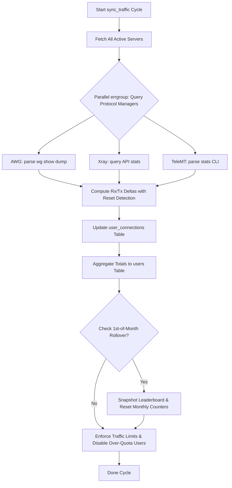

# Background Jobs & Orchestrator Specification (`06-background-jobs.md`)

> **Target Packages:** `internal/service/orchestrator`, `internal/service/supervisor`, `internal/service/reconciliation`  
> **Source Python Files:** `app/services/background_orchestrator.py`, `app/services/background_supervisor.py`, `app/services/startup_reconciliation.py`, `app/services/user_operations.py`  
> **Status:** Ground Truth Specification for Go Rewrite

---

## 1. Concurrency Architecture

The Go background subsystem replaces Python's `asyncio` loops with structured concurrency using `golang.org/x/sync/errgroup` and standard `context.Context`.

```
                  ┌─────────────────────────────────────┐
                  │    BackgroundTaskSupervisor         │
                  │  - Panic Recovery                   │
                  │  - Sliding Window Restarter (3/300s)│
                  │  - Graceful Shutdown Lifecycle      │
                  └──────────────────┬──────────────────┘
                                     │ spawns
                                     ▼
                  ┌─────────────────────────────────────┐
                  │   BackgroundTaskOrchestrator        │
                  │  - Boot Delay: 60s                  │
                  │  - Interval: 600s (Ticker)          │
                  └──────────────────┬──────────────────┘
                                     │ executes via errgroup
       ┌─────────────────────────────┼─────────────────────────────┐
       ▼                             ▼                             ▼
┌──────────────┐              ┌──────────────┐              ┌──────────────┐
│ sync_traffic │              │ check_reach  │              │ check_tunnels│
│ (Max 10 Conc)│              │ (Noise UDP)  │              │ (VPN Phase 4)│
└──────────────┘              └──────────────┘              └──────────────┘
```

---

## 2. Periodic Task Specifications

### 2.1 Task 1: Traffic Synchronization & Rollover (`sync_traffic`)

* **Schedule:** Every 600s (10 minutes).
* **Worker Pool Concurrency:** Max 10 concurrent SSH sessions across servers (`g.SetLimit(10)`).



#### Step-by-Step Algorithm:

1. **Delta Calculation & Counter Reset Handling:**
   ```go
   func computeDelta(current, last int64) int64 {
       if current < last {
           // Counter was reset (remote container restarted or host rebooted)
           return current
       }
       return current - last
   }
   ```
2. **Database Update within Transaction:**
   - Update `user_connections`:
     ```sql
     UPDATE user_connections SET
         last_rx = :current_rx,
         last_tx = :current_tx,
         traffic_delta_rx = :delta_rx,
         traffic_delta_tx = :delta_tx,
         traffic_total_rx = traffic_total_rx + :delta_rx,
         traffic_total_tx = traffic_total_tx + :delta_tx,
         traffic_total = traffic_total + :delta_rx + :delta_tx
     WHERE id = :connection_id;
     ```
   - Update `users`:
     ```sql
     UPDATE users SET
         traffic_used = traffic_used + :user_delta,
         traffic_total = traffic_total + :user_delta,
         traffic_total_rx = traffic_total_rx + :user_delta_rx,
         traffic_total_tx = traffic_total_tx + :user_delta_tx,
         monthly_rx = monthly_rx + :user_delta_rx,
         monthly_tx = monthly_tx + :user_delta_tx
     WHERE id = :user_id;
     ```

3. **1st-of-the-Month Rollover:**
   - Condition: `now.UTC().Day() == 1` and `last_reset_at.Month() != now.Month()`.
   - Action:
     1. Calculate previous month year & month numbers.
     2. Save snapshot: `db.SaveLeaderboardSnapshot(ctx, prevYear, prevMonth)`.
     3. For all users with `traffic_reset_strategy == "monthly"`:
        ```sql
        UPDATE users SET
            monthly_rx = 0,
            monthly_tx = 0,
            traffic_used = 0,
            monthly_reset_at = :now
        WHERE traffic_reset_strategy = 'monthly';
        ```
   - *Note on `traffic_reset_strategy`:* In runtime, only `monthly` triggers rollover resets on the 1st of each month (and `never` ignores it). `daily` is accepted by schema validators for compatibility/extension, but is NOT actively scheduled in the background orchestrator. `dev_bot` and `qa_bot` should not expect or build a daily cron runner for traffic resets.

4. **Quota Limit Enforcement:**
   - Find all enabled users where `traffic_limit > 0` AND `traffic_used >= traffic_limit`.
   - Set `enabled = 0` in `users` table.
   - Spawn parallel SSH workers to disable peer connections on remote servers (e.g. remove peer from `wg0.conf` or toggle disabled state).

---

### 2.2 Task 2: User Expiration (`check_expiry`)

* **Algorithm:**
  1. Query active users where `expires_at` is set and non-empty.
  2. Parse `expires_at` as ISO timestamp.
  3. If `time.Now().UTC().After(expiresAt)`:
     - Update user: `enabled = 0`.
     - Disable user connections on remote servers.
     - Log INFO: `User %s expired at %s, disabling account`.

---

### 2.3 Task 3: Reachability Probing (`check_server_reachability`)

* **Execution:**
  1. For each server, spawn probing goroutine (`errgroup`).
  2. Probe TCP SSH port (timeout 3.0s).
  3. For AWG protocol: execute UDP Noise IK handshake probe (`awg_health.CheckAWGReachability`).
  4. Update in-memory reachability cache (`models.ServerCheckResponse`).

---

### 2.4 Task 4: Auto-Trial Mimicry Handshake Monitor (`check_auto_trial_handshakes`)

* **Execution:**
  1. Find all AWG connections where `awg_mimicry == "auto"`.
  2. Query `wg show awg0 latest-handshakes` via SSH.
  3. If latest handshake timestamp is 0 or older than 180s:
     - Rotate mimicry profile to next candidate in order: `auto` → `tls` → `quic` → `dns` → `sip`.
     - Re-render client config and update `user_connections.awg_mimicry`.
     - Log INFO: `Auto-trial rotated mimicry for client %s to %s`.

---

### 2.5 Task 5: VPN Backend Tunnel Health Monitor (NEW - Phase 4E & 6)

* **Execution:**
  1. Iterate over all records in `backend_tunnels` table with `status != "disabled"`.
  2. Send in-process AWG Noise handshake probe to backend endpoint via `amneziawg-go`.
  3. Measure latency in milliseconds.
  4. If handshake succeeds:
     - Update `status = "active"`, `latency_ms = latency`, `last_health_check = now`.
  5. If handshake fails or times out (>2000ms):
     - Update `status = "degraded"`.
     - Trigger session migration for connected users on this tunnel.

---

### 2.6 Task 6: VPN Session Rebalancer (NEW - Phase 4E & 6)

* **Execution:**
  1. Query active backend tunnels and their connection counts.
  2. If load variance exceeds configured threshold (e.g. one backend has >40% more sessions than average):
     - Mark select sessions on overloaded backend as `status = "draining"`.
     - Reassign new incoming packet flows to lighter backends.
     - Update `vpn_sessions.backend_tunnel_id`.

---

## 3. Crash Recovery & Circuit Breaker (`internal/service/supervisor`)

```go
package supervisor

import (
	"context"
	"log/slog"
	"sync"
	"time"
)

type Supervisor struct {
	maxRestarts int           // Default: 3
	window      time.Duration // Default: 300s
	restarts    []time.Time
	mu          sync.Mutex
}

func (s *Supervisor) RunWithRecovery(ctx context.Context, name string, taskFn func(ctx context.Context) error) {
	for {
		select {
		case <-ctx.Done():
			slog.Info("Supervisor received shutdown signal", "task", name)
			return
		default:
		}

		err := func() (taskErr error) {
			defer func() {
				if r := recover(); r != nil {
					slog.Error("Task panicked", "task", name, "panic", r)
					taskErr = fmt.Errorf("panic: %v", r)
				}
			}()
			return taskFn(ctx)
		}()

		if err == nil {
			return
		}

		slog.Error("Task exited with error", "task", name, "err", err)

		s.mu.Lock()
		now := time.Now()
		// Prune restarts older than sliding window
		cutoff := now.Add(-s.window)
		var recent []time.Time
		for _, t := range s.restarts {
			if t.After(cutoff) {
				recent = append(recent, t)
			}
		}
		recent = append(recent, now)
		s.restarts = recent

		if len(s.restarts) > s.maxRestarts {
			s.mu.Unlock()
			slog.Error("Task exceeded maximum restart limit; tripping circuit breaker", "task", name)
			return
		}
		s.mu.Unlock()

		time.Sleep(5 * time.Second)
	}
}
```
